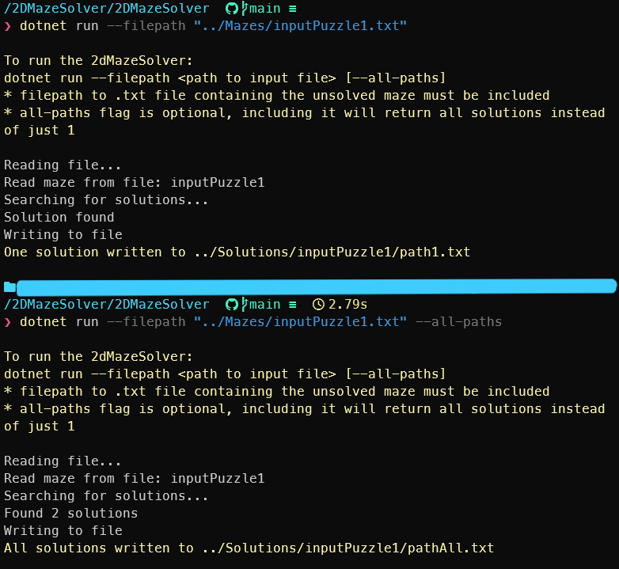

# 2D Maze Solver
This program will find solutions to a maze in .txt format.

The maze should be a .txt file containing the following cell types in a grid represented by the indicated characters:
- Start: 'S'
- Goal: 'G'
- Open (cells that can be navigated through): '.'
- Blocked (walls/obstacles that cannot be navigated through): '#'

The maze solver will output to a .txt file. Solution paths will be indicated with '+'

## How to Run
1) Ensure you have .NET 10 installed
2) In the terminal, navigate to the folder containing the `.csproj` file. Example: `cd ./2DMazeSolver/2DMazeSolver`
3) Use the command `dotnet run --filepath <path to input file> [--all-paths]`
    - The filepath to the .txt file containing the unsolved maze must be included
    - The all-paths flag is optional. Including it will return all solutions found. Excluding it will only print one solution to the maze.
  

